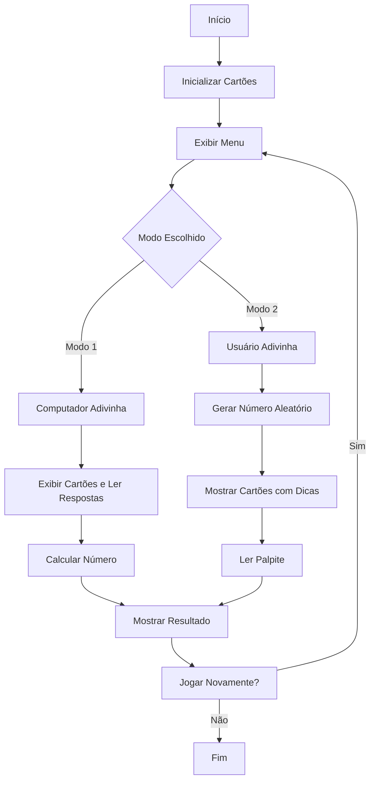

```markdown
# Relatório Técnico - Implementação do Jogo Magic6

**Disciplina:** Programação em Sistemas Computacionais  
**Trabalho:** Prático I  
**Data de Entrega:** 13/05/2023  

---

## 1. Introdução
Este relatório descreve a implementação do jogo Magic6 em linguagem C, conforme os requisitos especificados. O jogo baseia-se na representação binária de números entre 1 e 63, utilizando 6 cartões para adivinhar o número pensado pelo utilizador ou pelo computador.

---

## 2. Arquitetura do Programa

### 2.1. Estruturas de Dados
- **Cartões**: Matriz `cartoes[6][63]` armazena os números de cada cartão.
- **Tamanhos**: Vetor `tamanhosCartoes[6]` guarda a quantidade de números em cada cartão.

### 2.2. Fluxograma Simplificado


---

## 3. Implementação

### 3.1. Funções Principais

| Função               | Descrição                                                                 |
|----------------------|---------------------------------------------------------------------------|
| `inicializaCartoes()` | Preenche os cartões conforme a representação binária (1<<bit).           |
| `carregaMenu()`       | Exibe menu interativo e valida a escolha do utilizador (1-3).            |
| `jogoManNum(modo)`    | Controla a lógica dos dois modos de jogo.                                |
| `apresentaCartao(n)`  | Exibe o cartão `n` formatado (8 números/linha).                          |
| `calcularNumero()`    | Soma potências de 2 baseado nas respostas (Modo 1).                      |

### 3.2. Lógica de Cartões
Cada cartão corresponde a um bit na representação binária:
```c
Cartão 1: Bit 2⁰ (1)   → Números ímpares
Cartão 2: Bit 2¹ (2)   → Números com 2 em binário (2,3,6,7...)
...
Cartão 6: Bit 2⁵ (32)  → Números ≥32
```

---

## 4. Testes Realizados

### 4.1. Casos de Teste (Modo 1)
| Número | Cartões com Resposta "1"  | Resultado |
|--------|---------------------------|-----------|
| 19     | 1, 2, 5                   | 19 ✓      |
| 44     | 3, 4, 6                   | 44 ✓      |
| 63     | Todos os cartões          | 63 ✓      |

### 4.2. Casos de Teste (Modo 2)
| Número Gerado | Palpite | Resultado        |
|---------------|---------|------------------|
| 58            | 58      | Acerto ✓         |
| 13            | 15      | Erro (era 13) ✗  |

---

## 5. Dificuldades e Soluções

1. **Geração dos Cartões**:
   - *Problema*: Inicialização incorreta dos números faltantes.
   - *Solução*: Uso de operação bit-a-bit `(num & (1 << bit))`.

2. **Validação de Entrada**:
   - *Problema*: Loop infinito com caracteres inválidos.
   - *Solução*: `while(getchar() != '\n')` para limpar buffer.

3. **Formatação de Saída**:
   - *Problema*: Cartões desalinhados.
   - *Solução*: `printf("%4d", ...)` e quebras de linha a cada 8 números.

---

## 6. Conclusão
O programa implementa com sucesso:
- Dois modos de jogo interativos
- Validação robusta de entradas
- Cálculo preciso baseado em binários
- Interface clara e organizada

**Melhorias Futuras**: Adicionar interface gráfica ou suporte para mais números.

---

## 7. Anexos


- Exemplo de Execução:
  ```
  === Cartão 1 ===
    1   3   5   7   9  11  13  15
    17  19  21  23  25  27  29  31
    ...
  ```
```